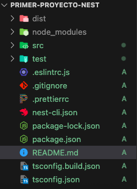
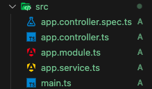
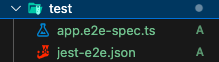

## Estructura de NestJS

**_Teoría_**

Video de Youtube: https://youtu.be/Y0NVKaLK2us?feature=shared

En nuestro proyecto de NestJS podemos ver varios archivos y carpetas que son generadas por defecto al crear nuestro proyecto.

A continuación explicaremos cada uno de los que conforman la estructura de NestJS:

**`DIST`**

Todo proyecto de Javascript tiene este directorio donde se almacenan las librerías y dependencias que son descargadas con NPM.

En sí es donde se almacenan los archivos transpilados y listos para la producción de la aplicación, los cuales son generados a partir del código fuente de TypeScript.

**`NODE_MODULES`**

Esta contiene todas las dependencias del proyecto, incluyendo los paquetes de Node.js y las bibliotecas de terceros instalados a través de npm.

**`SRC`**

Este directorio es donde se encuentran todos los archivos fuente de la aplicación. Aquí se define la lógica principal y componentes de la aplicación, como los controladores, servicios, módulos y otros.

**`TEST`**

En este directorio podemos encontrar los archivos de prueba para las diferentes partes de la aplicación.

NestJS admite dos tipos de pruebas principales: las pruebas unitarias y las E2E (End-to-End).

**Pruebas Unitarias**

Estas se centran en probar unidades individuales del código, como los métodos, funciones o clases. Sirven para comprobar que cada unidad funcione sin depender de externos.

**Pruebas E2E**

Estas pruebas simulan la interacción del usuario con la aplicación. Sirven para enviar solicitudes HTTP al servidor y verificar las respuestas.

- **`.eslintrc.js`**: permite detectar tempranamente errores y resolverlos.
- **`.gitignore`**: indica a Git qué archivos o directorios debe ignorar.
- **`.prettierrc`**: sirve para la configuración del autoformateo de código.
- **`nest-cli.json`**: configuraciones de NestJS.
- **`package-lock.json`**: dependencias que se generaron al instalar el proyecto.
- **`package.json`**: sirve para el manejo de dependencias, scripts y metadatos para el proyecto.
- **`README.md`**: sirve para la documentación del proyecto.
- **`tsconfig.build.json`**: sirve para la configuración de TypeScript.
- **`tsconfig.json`**: extensión con más configuraciones para TypeScript.

**_Reflexión_**

NestJS tiene muchas ventajas. A continuación veremos las características positivas que tiene este framework.

- **Arquitectura flexible y modular**:
  - Permite dividir componentes de aplicaciones en pequeños módulos.
  - Facilita la escalabilidad y mantenimiento sin comprometer la usabilidad.

- **Soporte para bases de datos**:
  - Admite bases de datos relacionales y no relacionales como Redis, PostgreSQL, MongoDB y MySQL.

- **Integración con sistemas de mensajería**:
  - Permite la comunicación asincrónica con aplicaciones como Kafka, RabbitMQ, Redis y AWS SQS.

- **Soporte para microservicios**:
  - Permite crear y escalar pequeñas aplicaciones de manera independiente.

- **Creación de rutas esquematizadas**:
  - Utiliza un enrutador incorporado para asignar controladores a rutas específicas.

- **Decoradores**:
  - Ayudan a definir servicios, controladores, rutas y otros elementos para mantener el código limpio y legible.

- **Middlewares**:
  - Utilizados para procesar solicitudes HTTP antes de llegar a los controladores.

- **Comunidad activa**:
  - Cuenta con una comunidad de desarrolladores colaborativa que ofrece recursos de aprendizaje, extensiones y módulos.

**_Analogía_**

| Características      | ExpressJS                                      | NestJS                                          |
|----------------------|------------------------------------------------|-------------------------------------------------|
| Arquitectura         | Minimalista y flexible                         | Modular y orientada a servicios                  |
| Lenguaje Principal   | JavaScript                                     | TypeScript                                      |
| Enfoque              | Flexibilidad y control total sobre la aplicación | Estructura y patrones predefinidos para facilitar el desarrollo |
| Enrutamiento         | Uso de funciones middleware para mejorar rutas  | Sistema de enrutamiento incorporado con decoradores y controladores |

**_Resumen_**

La estructura básica de un proyecto en NestJS incluye directorios como `DIST` (archivos transpilados), `NODE_MODULES` (dependencias), `SRC` (archivos fuente) y `TEST` (archivos de prueba).

NestJS ofrece ventajas clave como una arquitectura flexible y modular, soporte para bases de datos (relacionales y no relacionales), integración con sistemas de mensajería, soporte para microservicios, rutas esquematizadas con enrutador incorporado, decoradores para mantener el código limpio, middlewares para procesar solicitudes HTTP, y una comunidad activa que proporciona recursos de aprendizaje y extensiones.

**_Referencias_**

- [Manual de NestJS. Desarrolloweb.com](https://desarrolloweb.com/manuales/manual-nestjs)
- [Servicio de las Tecnologías de la Información y las Comunicaciones-Universidad de Almería. Introducción a NestJS. Github.io](https://ualmtorres.github.io/SeminarioNestJS/?ref=reactivisima.com)
- [Platzi](https://platzi.com/clases/2272-nestjs/37071-estructura-de-aplicaciones-en-nestjs/)
